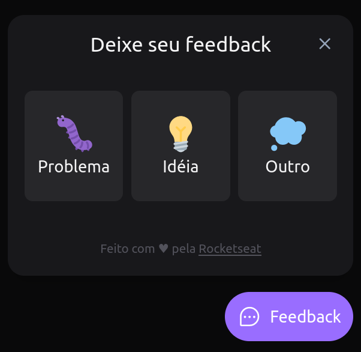

# Feedget

    

## 👨‍💻 Tecnologias

    
    
    
    
    

        
            
            Para hospedar o Front-end
        
        
            
            Para hospedar o Back-end
        
    

## 📝 Projeto
O projeto foi feito com o intuito de ajudar os usuários a reportarem feedbacks para site em que está localizado. Podendo reportar algum problema ou idéia e também, alguma mensagem para direção do site.
O usuário também tem a opção de enviar a screenshot da tela sem precisar salvar a foto no computador.

## Layout
O layout está disponível neste link: [Figma](https://www.figma.com/file/HqtaxgYxaY7WyzvgcSE6Cm/Feedback-Widget-(Community)?node-id=100%3A2114)

## Features
- [x] Envio de e-mails quando recebe um novo feedback;
- [x] Screenshot sem salvar no PC;

## Como rodar o projeto localmente?

### Web

### Server

### Melhorias
- [ ] Tema light/dark;
- [ ] Dashboard;
- [ ] Autenticação da Dashboard
- [ ] Usar serviço de e-mail
- [ ] Melhorar o HTML/CSS do e-mail